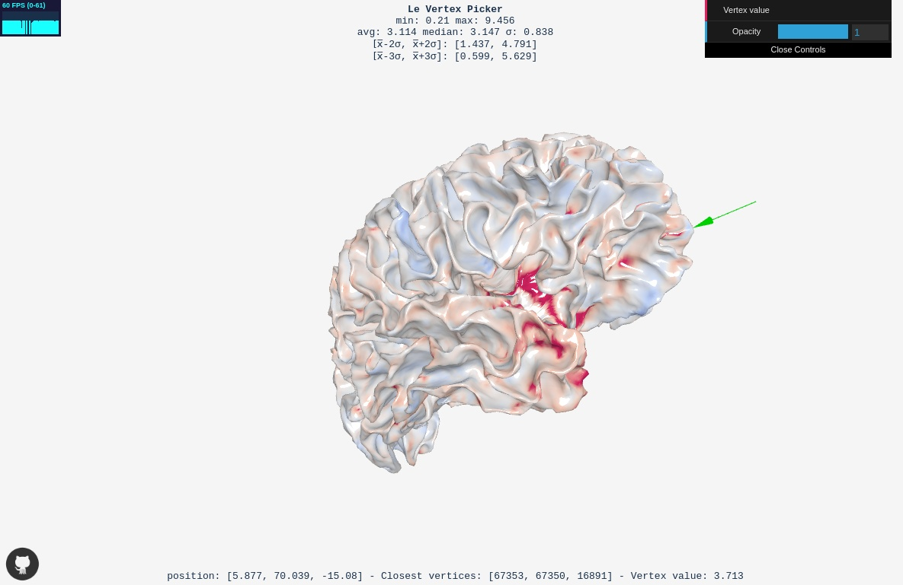

# LeVertexPicker

[[DEMO](https://jonathanlurie.github.io/LeVertexPicker/)] - use a mesh file from the folder `models` (like [this one](models/ping_P0007_white_surface_right_327680.obj)) and a description file from the folder `thickness` (like [this one](thickness/ping_P0007_native_rms_rsl_tlaplace_0mm_right.txt)).

This is a web based *mniobj* mesh viewer to which we can specify a description file. The description file is a text file that must contain as many lines as the number of vertices on the mesh. Each line contains a floating number.

## How to use?
- Use the top-right button `OBJ mesh` to open a **mniobj** mesh file, then it may take a few seconds to load.
- Once loaded, the button turns into a **Vertex value** opener. Click on it to select your description file.
- Once the description file loaded, few statistics are displayed at the top of the screen and a color map applies.
- You can now hover (not *clicking*) the mesh with the pointer while holding `SHIFT` to display the value of a current vertex at the bottom of the screen.

## The color map
The *blue-to-red* color map takes its minimum (blue) at **[avg - 3*SD]** and its maximum (red) at **[avg + 3*SD]**, *avg* being the average and *SD* being the standard deviation.  
Obviously, using such a range is relevant only if your data follows a [normal distribution](https://en.wikipedia.org/wiki/Normal_distribution).

# License
MIT
